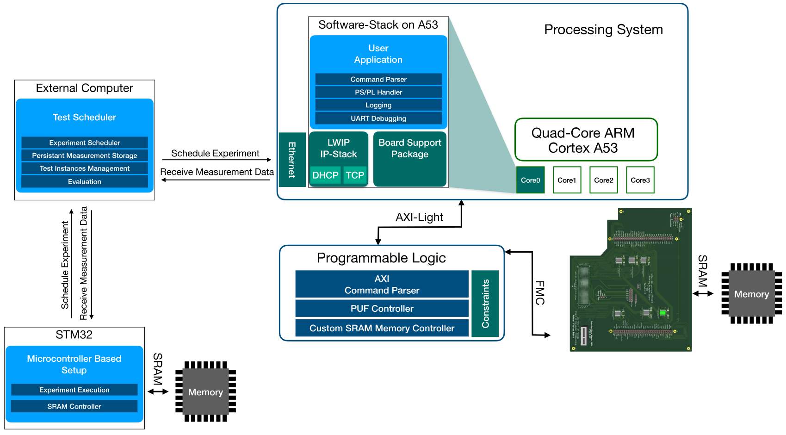
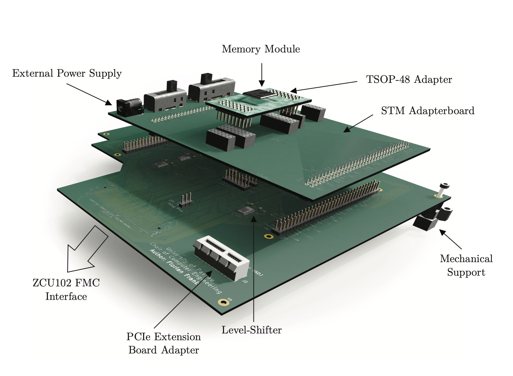
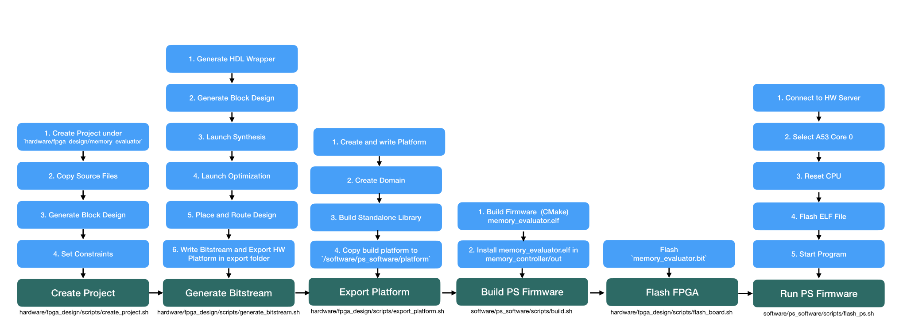

# Memory PUF Evaluation Setup

This repository contains all components required for an extensive evaluation of memory-based PUFs, with a focus on emerging memory technologies such as FRAM, MRAM, and ReRAM. The setup is built around a Xilinx ZCU102 FPGA and is designed to interface with any memory device featuring an SRAM-compatible parallel interface.

The various components included in this repository are illustrated in the following figure:

<div style="text-align: center;">  </div>

The components are divided into **hardware** and **software** categories, following the structure of this repository.  

### Hardware

The **hardware** folder contains:  

- **FMC Adapter PCB Layout:**  
  A PCB adapter designed to interface various memory modules with the ZCU102 through its FMC connector. It supports memories with up to 24 address lines and 16 data lines and bridges the logic voltage level differences between the ZCU102 and the connected memory modules. Additionally, it provides options for connecting external power supplies and includes debugging interfaces. The design prioritizes signal integrity and minimizes glitches and noise.

<center>
<div style="text-align: center;">  </div>
</center>

- **FPGA Design:**  
  Contains the FPGA design implementing a custom SRAM memory controller with all timing parameters adjustable at runtime. It supports several types of experiments, including row hammering as well as read and write latency variations. Timing parameters can be tuned with a granularity of 2.5 nanoseconds. The design also includes an AXI interface for communication with the ZCU102’s processing system.

### Software

The **software** folder contains:  

- **PS Software:**  
  Implements the firmware running on the Processing System (PS) of the ZCU102. It manages communication with the PL to schedule and control experiments, as well as to receive measurement data through the same interface.  
  Additionally, it provides a network interface for receiving commands and parameters from an external program hosting the experiment scheduler (described below). The firmware also transmits the collected measurement data back to this external program for persistent storage and further analysis.

- **Experiment Scheduler:**  
  A program that runs on an external computer connected to the ZCU102 via Ethernet. It allows the definition of various experiments and hardware classes (e.g., specific memory models), as well as instances of those classes. The scheduler manages the execution of experiments on these instances, delegating them either to the PS Software on the ZCU102 or to a microcontroller-based reference setup (described next).  
  It also collects the resulting measurement data, stores it persistently, and keeps track of the experiments executed for each hardware instance.

<center>

</center>

- **Microcontroller-Based Setup:**  
  An implementation running on an STM32F429 microcontroller with an integrated memory controller, capable of executing the same set of experiments as the ZCU102. However, this setup is constrained by the significantly lower clock frequency of its memory controller (120 MHz compared to 400 MHz on the FPGA). Communication with the test scheduler is established via a UART interface.

## Quick Setup

The following provides the basic information to setup the memory evaluator. 

### Prerequisites

To build the PCB, **KiCad version 6** is required.  
To build the FPGA design and PS firmware, **Xilinx Vivado 2022.2** with **Vitis** must be installed.  
Note that generating the bitstream for the **ZCU102** requires the **Vivado ML Enterprise Edition**.  

The scheduler requires **Python 3.10**.  

A detailed list of all dependencies can be found in the respective component folders.

### PCB Production

To produce the PCB, navigate to `hardware/pcbs/fmc_memory_adapter`, open the project in **KiCad**, export the Gerber files, and upload them to your preferred PCB manufacturer.  
The required components are listed in the **bill_of_material** folder.

### MPSoC Setup

To set up the FPGA and the corresponding firmware on the processing system, we provide a script that automates all required steps.  
Simply run the following commands:

```bash
cd scripts
./setup_and_run_environment.sh
```

This script performs the steps illustrated in the following diagram:

<div style="text-align: center;">  </div>

> ⚠️ This script has been verified only on **Ubuntu 22.10**, with **Vivado** installed in `/opt/Xilinx`.  
> To run it in a different environment, adjustments to the `VIVADO_PATH` variable or direct execution of the `.tcl` scripts may be necessary.


Furthermore, as shown in the figure above, the `./setup_and_run_environment.sh` script directly invokes several other scripts displayed at the bottom.  
These scripts can also be executed directly.  
Additional information about each script can be found in the respective folders containing them.

### Microcontroller-based Setup

To compile the microcontroller-based setup located in `software/memory_evaluator_stm32f429`, we provide a Docker-based build process.  
This approach eliminates the need to install the full toolchain on your local machine.  

First, build the Docker image by running:

```bash
cd software/memory_evaluator_stm32f429
docker build -t stm32f429-build .
```

Then, compile the program by executing:

```bash
././compile_fw_docker.sh
```

This command will start the Docker container, compile the firmware, and copy the resulting `MemoryController.elf` into the `software/memory_evaluator_stm32f429/bin` folder.

To flash the device, OpenOCD integrated within the CLion IDE was used. For more details, refer to the [`README.md`](/software/memory_evaluator_stm32f429/README.md) file.


### Run the scheduler


All necessary dependencies for the scheduler can be installed by running:

```bash
cd software/experiment_scheduler/scripts
./setup.sh
```

To start the scheduler, simply execute:


```bash
cd software/experiment_scheduler/scripts
./run.sh <test_specification>.yaml
```

More information about the test specification format can be found in the scheduler’s README file.


## Contact

If you encounter any issues or errors, please open an issue on this page or contact me at:  **florian.frank(at)uni-passau.de**
