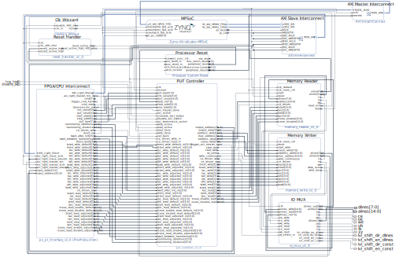

### FPGA Memory Evaluator

> The FPGA implementation provides an FPGA-based memory controller and PUF framework compatible with the AMD Xilinx ZCU102 evaluation board.


This folder contains all components required to implement the FPGA-based memory controller and PUF execution logic.  
It provides an FPGA–CPU interface that enables communication for various memory tests, such as Row Hammer experiments or violations of read/write protocol specifications. Measurement data is transmitted through the same interface, allowing analysis on the CPU and persistent data storage.  

Currently, the design supports SRAM-compatible memory chips. The provided FPGA constraints are fully compatible with the FMC adapter board located in `hardware/pcbs`.  
The memory interface timing can be configured in 2.5 ns increments, supporting a forwarded clock frequency of up to **400 MHz** for the memory controller.  

At this stage, the design is only compatible with the **AMD Xilinx ZCU102 Evaluation Board**.

<div style="text-align: center;">
  
</div>

### Modules

As shown in the block design above, the implementation consists of several custom modules, which are briefly described below:

- **MPSoC (Zynq UltraScale+ MPSoC):** Main processing unit, providing the interface and interconnect between the FPGA and CPU.

- **FPGA/CPU Interconnect:** Implements an AXI Lite interface with a master and slave to enable data transfer between the CPU and programmable logic. It includes a parser that translates configuration parameters from the CPU into dedicated signals for the PUF controller, and aggregates measurement data into single frames for transmission back to the CPU.

- **PUF Controller:** Executes various PUF experiments based on configuration parameters received from the FPGA/CPU interconnect. Currently, it supports Row Hammering experiments, write protocol violations, and read protocol variations, which can also be used for voltage variation experiments. Each experiment includes an initialization phase that writes known values to selected memory cells, followed by the PUF execution phase. The PUF Controller serves as the central module, coordinating interactions between the memory controllers and the FPGA/CPU interconnect.

- **Clock Wizard:** Generates a 400 MHz clock from the 100 MHz base clock to drive the memory controller, allowing timing adjustments with a 2.5 ns resolution. Only the memory read and write modules operate at this frequency, while measurement data transmission is synchronized with the 100 MHz clock via the PUF controller.

- **IO MUX:** Custom multiplexer module that manages access to the shared address, data, and control lines. It directs data lines for read or write operations and controls the dual-supply bus transceivers used to bridge different voltage logic levels. Further details on these components can be found in `hardware/pcbs/fmc_memory_adapter`.

- **Memory Writer:** Dedicated module for writing data to the memory module in configurable address blocks. It implements an SRAM-compatible interface, with all timing parameters adjustable in 2.5 ns increments.


- **Memory Reader:** Dedicated module for reading data to the memory module. It implements an SRAM-compatible interface, with all timing parameters adjustable in 2.5 ns increments.

- **Auxiliary Modules:** Additional supporting modules, such as reset handlers and AXI interconnect components, are included to ensure proper operation and communication between the main modules.


### Prerequesites

The implementation is currently supported only in **Vivado 2022.2** due to dependencies on specific IP core versions, such as the Clocking Wizard and the Zynq UltraScale+ MPSoC IP core.  
However, compatibility with other Vivado versions can be achieved by modifying the `main_block_design.tcl` file and replacing unsupported IP cores with versions supported by the used Vivado version. This approach has been verified to work with **Vivado 2023.2**.

> ⚠️ Ensure you have the appropriate license to generate bitstreams for the ZCU102, as this requires **Vivado ML Enterprise Edition**.

### Setting up the project. 

To simplify project setup, we provide several scripts in the `scripts` folder.  
To create the project, simply run `./create_project.sh`.  

This script sources `create_project.tcl`, which generates a new project named `memory_evaluator` within the `fpga_implementation` directory. It automatically creates all necessary folders, adds all source files, builds the block design, and imports all required IP cores and constraints.

```bash
❯ ./create_project.sh
**************************************
********** Memory Evaluator **********
**************************************

Start Creating Project ...
INFO: Creating new project...

****** Vivado v2022.1 (64-bit)
  **** SW Build 3526262 on Mon Apr 18 15:47:01 MDT 2022
  **** IP Build 3524634 on Mon Apr 18 20:55:01 MDT 2022
    ** Copyright 1986-2022 Xilinx, Inc. All Rights Reserved.

source tcl/create_project.tcl
```

At the end of the script, you will be asked:  
`Open Project in Vivado GUI? [y/N]` — selecting `y` will open the project directly in Vivado.

> ⚠️ This script has been tested only on **Ubuntu 22.04** with **Vivado 2022.2**.  
> To use a different Vivado version, either adjust the `VIVADO_PATH` variable in the script or run
> `<path_to_your_installation>/vivado -mode batch -source tcl/create_project.tcl` directly.


