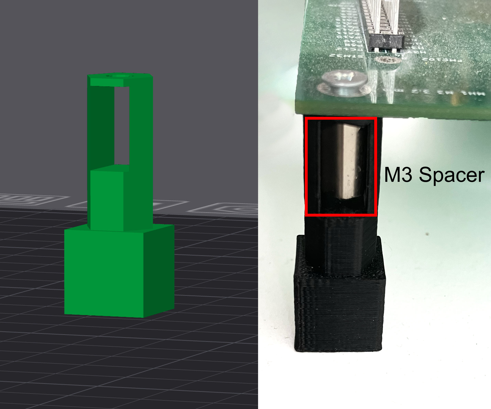
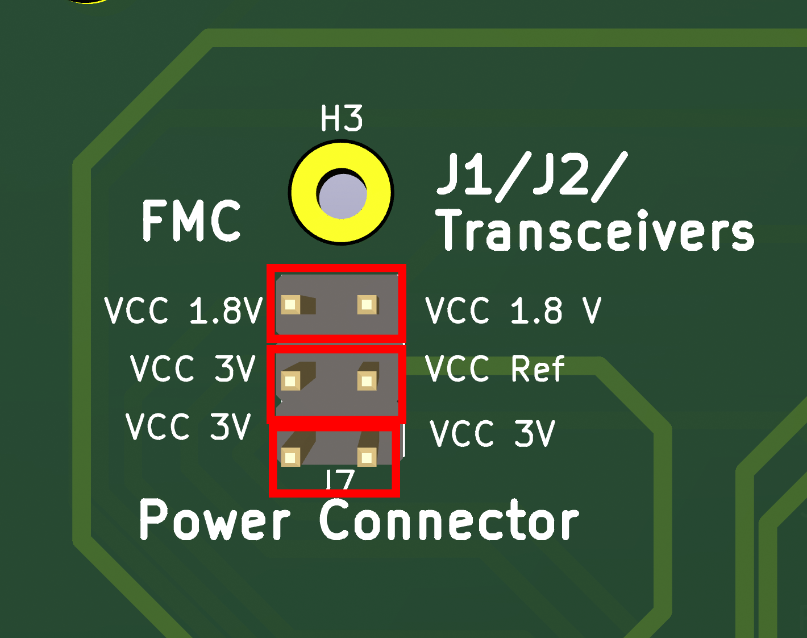

# FMC Memory Adapter PCB

>This board enables easy evaluation and interfacing of FRAM, MRAM, and ReRAM memory modules with the AMD ZCU102 FPGA via a standard FMC connector.

This folder contains all the design and manufacturing files for a Printed Circuit Board (PCB) adapter that enables interfacing various FRAM, MRAM, and ReRAM memory modules with the [AMD Zynq UltraScale+™ MPSoC ZCU102 Evaluation Kit](https://www.amd.com/en/products/adaptive-socs-and-fpgas/evaluation-boards/ek-u1-zcu102-g.html). 

The board is designed to connect to the FPGA Mezzanine Card (FMC) J5 connector on the ZCU102. It acts as a level-shifting bridge, converting the board’s output power rails (1.2 V, 1.5 V, or 1.8 V) to a standard CMOS 3.3 V logic level.

The PCB design is shown in the following figure:

  

The board uses an ANSI/VITA 57.1 compatible FMC adapter, shown at the bottom, and routes the logical signals, e.g., for the memory address bus, data bus, and control signals, to the two horizontal pin headers, which are compatible with the pinout of an STM32F429 (which served as the first evaluation platform).

To support different voltage levels and enable testing with various voltages, level shifters are used. They convert the input reference voltage (e.g., 1.8 V) into the voltage levels required by the memory module (e.g., CMOS 3.3 V). In this way, the power supply of the memory module can be decoupled, allowing tests with different reference voltages using external power supplies.

The board is constructed as a four-layer PCB, with the wires implementing logical levels primarily routed on the first two layers. These wires have equal line lengths to avoid potential glitches. The third layer is connected to ground, enhancing the board’s electromagnetic compatibility. On the backside, all ground connections and the power supply are routed using 0.8 mm traces.

The pin headers on the left side are used to connect different reference voltages and ground connections, as described later in the pinout description. The pin header in the middle is used for debugging purposes, allowing the output signals provided by the ZCU102 to be probed.

An additional connector is provided to supply a reference voltage to the FMC adapter’s VADJ_SENSE pin. This allows the VADJ_FMC power rail voltage to be selected using a resistor voltage divider.

### Prerequesites

The board was designed with [KiCAD](https://www.kicad.org/download/) PCB Editor Version 8.0.7. Make sure its installed on your system. 

For PCB assembly, standard soldering tools can be used. However, soldering the FMC connector requires an SMD soldering station.

Additionally, the mechanical supports are 3D-printed and should be installed at the designated mounting points to ensure proper board stability.

### Components Description

The design uses the components listed by their schematic symbols.  
>Prices are based on 2025 data from common distributors, including Mouser and DigiKey or Reichelt. Prices are declared without shipping.

| Ref.      | Type                        | Manufacturer      | Component Number     | Description                             | Unit Price | Qty | Total Price | Verified |
|-----------|-----------------------------|-----------------|-------------------|-----------------------------------------|------------|-----|-------------|----------|
| J8        | FMC Adapter                 | SAMTEC           | ASP-134488         | Connector between the FPGA J5 FMC adapter and the breakout board for Data Line D0 | 32 €       | 1   | 32 €        | ✅       |
| IC1 - IC6 | Dual-Supply Bus Transceiver | Texas Instruments | SN74AVC8T245PWG4 | Logic Level shifting using two reference power rails. | 1.32 €     | 6   | 7.92 €      | ✅       |
| C1 - C12  | Capacitors                  | KEMET             | C0805C104K5RAC7411 | 0.1 µF, 50 V DC, decoupling capacitors for bus transceivers (VCCA/VCCB inputs) | 0.10 €     | 12  | 1.20 €      | ✅       |
| P1, P2    | Pin Headers 2×32            | MPE               | 087-2-064-0-S-XS0-1260 | 2×32 straight pin headers, 2.54 mm pitch, for connecting the memory module | 1.10 €     | 2   | 2.20 €      | ✅       |
| J7        | Pin Headers Power Supply     | Würth Elektronik  | 61300621121        | 2×3 straight pin headers, 2.54 mm pitch, to access the power supply connector | 0.32 €     | 1   | 0.32 €      | ✅       |
| J11       | Pin Headers Ground Selectors | Würth Elektronik  | 61031421121        | 2×7 straight pin headers, 2.54 mm pitch, to access ground connections | 0.81 €     | 1   | 1.62 €      | ✅       |
| J5   | Pin Headers External Ground | Amphenol Commercial Products | 61300411121 | 1×4 straight pin headers, 2.54 mm pitch, for external ground connectors | 0.15 €     | 1   | 0.15 €      | ✅       |
| J1 - J4   | Pin Headers Ground Selectors | Amphenol Commercial Products | G800NA306018EU | 1×2 straight pin headers, 2.54 mm pitch, for single ground connectors | 0.09 €     | 4   | 0.36 €      | ✅       |
| J9        | Debug Pin Header             | Würth Elektronik  | 61300311121        | 1×3 straight pin headers, 2.54 mm pitch, for debug pins | 0.10 €     | 1   | 0.10 €      | ✅       |
| - | Voltage/Ground Selectors | MPE | 149-1-002-F0-XS | 2.54 mm jumper used to disconnect or select ground and voltage lines | 0.10 € | 14 | 1.40 € | ✅ |
| Ref. | Description              | Manufacturer | Part Number         | Details                                                    
| J6   | Extension Board Socket   | Amphenol      | 10018783-10010TLF   | PCIe connector (36 positions, 1.00 mm pitch) for extension cards supporting board detection and voltage rail PMBus interface | €0.70       | 11   | €0.70 | ✅ |
| Distance Spacers M3   | ECON         | D3X08I5MT      | M3 8 mm spacers to connect the mechanical support                 | 0.11 € | 2   | 0.22 €      |
| Screws M3 Thread      | APM HEXSEAL  | RM3X8MM-2701   | M3 × 0.5 screws to secure the mechanical support                  | 0.45 € | 2   | 0.90 €      |

The board was manufactured as a four-layer PCB with a standard HASL finish (TG150), leaded configuration, 2 mm thickness, 4 mil/4 mil track spacing, and a minimum hole size of 0.2 mm. A batch of five pieces was priced at approximately 130 €, including shipping, from [PCBgogo](https://www.pcbgogo.com).

The total cost to manufacture the complete PCB was approximately **179 €**, with an additional **49 €** required for the components. This estimate excludes the cost of extra materials needed for soldering and assembly.

### Exporting the PCB for Production

To prepare the PCB for production in **KiCad**, follow these steps:

1. Open the menu:  
   **File → Fabrication Outputs → Gerbers (.gbr)**

2. Include all required layers:  
   - Copper layers (Top and Bottom)  
   - Paste layers  
   - Silkscreen layers  
   - Solder mask layers  
   - Edge cuts  

3. Generate the **Drill Files** and **plot** all outputs into a dedicated folder.

4. **Compress (ZIP)** all generated files in that folder.

5. **Upload** the ZIP archive to your PCB manufacturer’s platform for fabrication.

### Assemble the Board

To assemble the board, solder all components according to their footprints. All components can be soldered using a standard soldering iron; however, the FMC interface requires the use of an SMD soldering station.

> ⚠️ **Important:** Ensure that all pin headers and the PCIe interface are soldered on the front side of the board, while the FMC interface must be soldered on the back side. You can find `Front` and `Back` markers printed on the PCB for guidance.

#### Mechanical Support

To maintain proper alignment and mechanical stability, dedicated board supports are provided.
The corresponding STL file for 3D printing is available in the `mechanical_support` directory.

Install the supports at the H1 and H2 mounting holes. An M2 spacer is inserted into each support and fixed in place using a screw from the top side of the board.

  

### Pinout Description

This section presents the different pinout descriptions based on the components uniquely identified within the design by their symbol names.

#### FMC Adapter (Symbol Name: J8)

> ⚠️ Verify that the pinout matches the constraints defined in your FPGA hardware design constraints file.

| Pin  | I/O Standard | Mapping Component | Component Pin | Description   | Verified |
|------|-------------|-----------------|---------------|------------------|----------|
| C10  | LVCMOS18    | IC1             | A1            |  Data Line D0    |    ✅    |
| C11  | LVCMOS18    | IC1             | A2            |  Data Line D1    |    ✅    |
| C14  | LVCMOS18    | IC1             | A3            |  Data Line D2    |    ✅    |
| C15  | LVCMOS18    | IC1             | A4            |  Data Line D3    |    ✅    |
| C18  | LVCMOS18    | IC1             | A5            |  Data Line D4    |    ✅    |
| C19  | LVCMOS18    | IC1             | A6            |  Data Line D5    |    ✅    |
| C22  | LVCMOS18    | IC1             | A7            |  Data Line D6    |    ✅    |
| C23  | LVCMOS18    | IC1             | A8            |  Data Line D7    |    ✅    |

| Pin  | I/O Standard | Mapping Component | Component Pin | Description   | Verfied  |
|------|-------------|-----------------|---------------|------------------|----------|
| C26  | LVCMOS18    | IC2             | A1            | Data Line D8     |    ✅    |
| C27  | LVCMOS18    | IC2             | A2            | Data Line D9     |    ✅    |
| D8   | LVCMOS18    | IC2             | A3            | Data Line D10    |    ✅    |
| D9   | LVCMOS18    | IC2             | A4            | Data Line D11    |    ✅    |
| D11  | LVCMOS18    | IC2             | A5            | Data Line D12    |    ✅    |
| D12  | LVCMOS18    | IC2             | A6            | Data Line D13    |    ✅    |
| D14  | LVCMOS18    | IC2             | A7            | Data Line D14    |    ✅    |
| D15  | LVCMOS18    | IC2             | A8            | Data Line D15    |    ✅    |

| Pin  | I/O Standard | Mapping Component | Component Pin | Description   | Verfied  |
|------|-------------|-----------------|---------------|------------------|----------|
| D17  | LVCMOS18    | IC4             | A1            | Address Line A0  |    ✅    |
| D18  | LVCMOS18    | IC4             | A2            | Address Line A1  |    ✅    |
| D20  | LVCMOS18    | IC4             | A3            | Address Line A2  |    ✅    |
| D21  | LVCMOS18    | IC4             | A4            | Address Line A3  |    ✅    |
| D23  | LVCMOS18    | IC4             | A5            | Address Line A4  |    ✅    |
| D24  | LVCMOS18    | IC4             | A6            | Address Line A5  |    ✅    |
| D26  | LVCMOS18    | IC4             | A7            | Address Line A6  |    ✅    |
| D27  | LVCMOS18    | IC4             | A8            | Address Line A7  |    ✅    |

| Pin  | I/O Standard | Mapping Component | Component Pin | Description   | Verified |
|------|-------------|-----------------|---------------|------------------|----------|
| G6   | LVCMOS18    | IC5             | A1            | Address Line A8  |    ✅    |
| G7   | LVCMOS18    | IC5             | A2            | Address Line A9  |    ✅    |
| G9   | LVCMOS18    | IC5             | A3            | Address Line A10 |    ✅    |
| G10  | LVCMOS18    | IC5             | A4            | Address Line A11 |    ✅    |
| G12  | LVCMOS18    | IC5             | A5            | Address Line A12 |    ✅    |
| G13  | LVCMOS18    | IC5             | A6            | Address Line A13 |    ✅    |
| G15  | LVCMOS18    | IC5             | A7            | Address Line A14 |    ✅    |
| G16  | LVCMOS18    | IC5             | A8            | Address Line A15 |    ✅    |

| Pin  | I/O Standard | Mapping Component | Component Pin | Description      | Verified |
|------|-------------|-----------------|---------------|---------------------|----------|
| G18  | LVCMOS18    | IC6             | A1            | Address Line A16    |    ✅    |
| G19  | LVCMOS18    | IC6             | A2            | Address Line A17    |    ✅    |
| G21  | LVCMOS18    | IC6             | A3            | Address Line A18    |    ✅    |
| G22  | LVCMOS18    | IC6             | A4            | Address Line A19    |    ✅    |
| G24  | LVCMOS18    | IC6             | A5            | Address Line A20    |    ✅    |
| G25  | LVCMOS18    | IC6             | A6            | General Purpose Pin |    ✅    |
| G27  | LVCMOS18    | IC6             | A7            | General Purpose Pin |    ✅    |
| G28  | LVCMOS18    | IC6             | A8            | General Purpose Pin |    ✅    |

| Pin  | I/O Standard | Mapping Component | Component Pin | Description         | Verified |
|------|-------------|-----------------|---------------|------------------------|----------|
| G30  | LVCMOS18    | IC3             | A1            | Output Enable !OE      |    ✅    |
| G31  | LVCMOS18    | IC3             | A2            | Write Enable !WE       |    ✅    |
| G33  | LVCMOS18    | IC3             | A3            | Chip Enable !CE        |    ✅    |
| G34  | LVCMOS18    | IC3             | A4            | Lower Byte Select !LB  |    ✅    |
| G36  | LVCMOS18    | IC3             | A5            | Upper Byte Select !UB  |    ✅    |
| G37  | LVCMOS18    | IC3             | A6            | Sleep Pin !ZZ          |    ✅    |

| Pin  | I/O Standard | Mapping Component | Component Pin | Description                               | Verified |
|------|---------------|------------------|----------------|------------------------------------------|----------|
| H11  | LVCMOS18      | E39              | 1              | 1.8 V reference pin (VADJ)               | ✅       |
| D36  | UTIL_3V3      | J7               | 1              | 3.3 V CMOS reference voltage             | ✅       |
| C39  | UTIL_3V3      | J7               | 1              | 3.3 V power supply for the memory module | ✅       |
| C34  | GND      | J10               | 1,3              | Pinheader ground connector P1 and P2.      | ✅       |
| D35  | GND      | J3, J4, J5               | 1,3              | External GND connector and GND for lvl shifter VREF_A and VREF_B | ✅ |

| Pin | I/O Standard | Mapping Component | Component Pin | Description                                 | Verified  |
|------|--------------|------------------|----------------|--------------------------------------------|-----------|
| H8   | LVCMOS18     | IC1, IC2         | DIR            | Data line direction control                | ✅        |
| H10  | LVCMOS18     | IC3–IC6          | DIR            | Address and control line direction control | ✅        |
| H7   | LVCMOS18     | IC1–IC6          | OE             | Output enable control                      | ✅        |

#### Controlling the power supply

The ANSI VITA 57.1 board supports the selection of differnt power rails (1.2V, 1.5V and 1.8V) which can be selected by a FMC adapter board.The regulation of the voltages is done on the ZCU using a Analog devices MAX15301 Voltage regulator internally, which ofers a PMBus interface, which is configurable via the PMBus connector of connector J84. All ne

Another method of setting the power rail is throughthe the ZCU USB UART interface (See (https://adaptivesupport.amd.com/s/article/62178?language=en_US)[https://adaptivesupport.amd.com/s/article/62178?language=en_US]). 

> ⚠️ Note we do not implement the detection and power negotiation according to the VITA 57.1 standard. We just se the powerrail to 1.8 V which is the default setting of the ZCU102. This functionallity can be implemed through an extension adapter which must be connected to PCB connector J6.

#### Dual Transceivers

Next, we list the connections between the Texas Instruments SN74AVC8T245PWG4 dual transceivers and the J1 and J2 pin headers that interface with the memory module.
Each transceiver operates with two reference power supplies: VCC (1.8 V) and VCC_REF. Both reference voltages are decoupled using 0.1 µF capacitors.

The DIR and Output Enable (OE) lines are controlled by the FPGA. An additional pin, H8, is used to control the data line direction, enabling both read and write operations over the same bus.

  

##### Dual Transceiver (IC1)

| Pin | I/O Standard | Mapping Component | Component Pin | Description | Verified  |
|------|--------------|------------------|----------------|------------|-----------|
| B1  | VCC REF     |   P1  |   PD14/D0          | Data Line D0        | ✅ |
| B2  | VCC REF     |   P1  |   PD15/D1          | Data Line D1        | ✅ |
| B3  | VCC REF     |   P2  |   PD0/D2           | Data Line D2        | ✅ |
| B4  | VCC REF     |   P2  |   PD1/D3           | Data Line D3        | ✅ |
| B5  | VCC REF     |   P1  |   PE7/D4           | Data Line D4        | ✅ |
| B6  | VCC REF     |   P1  |   PE8/D5           | Data Line D5        | ✅ |
| B7  | VCC REF     |   P1  |   PE9/D6           | Data Line D6        | ✅ |
| B8  | VCC REF     |   P1  |   PE10/D7          | Data Line D7        | ✅ |

##### Dual Transceiver (IC2)

| Pin | I/O Standard | Mapping Component | Component Pin | Description  | Verified |
|------|--------------|------------------|----------------|-------------|----------|
| B1  | VCC REF     |   P1  |   PE11/D8          | Data Line  D8        | ✅       |
| B2  | VCC REF     |   P1  |   PE12/D9          | Data Line  D9        | ✅       |
| B3  | VCC REF     |   P1  |   PE13/D10         | Data Line  D10       | ✅       |
| B4  | VCC REF     |   P1  |   PE14/D11         | Data Line  D11       | ✅       |
| B5  | VCC REF     |   P1  |   PE15/D12         | Data Line  D12       | ✅       |
| B6  | VCC REF     |   P1  |   PD8/D13          | Data Line  D13       | ✅       |
| B7  | VCC REF     |   P1  |   PD9/D14          | Data Line  D14       | ✅       |
| B8  | VCC REF     |   P1  |   PD10/D15         | Data Line  D15       | ✅       |

##### Dual Transceiver (IC3)

| Pin  | I/O Standard | Mapping Component| Component Pin  | Description        | Verified |
|------|--------------|------------------|----------------|--------------------|----------|
| B1   | VCC REF      |   P2             |   PD4/OE       | Output Enable      | ✅       |
| B2   | VCC REF      |   P2             |   PD5/WE       | Write Enable       | ✅       |
| B3   | VCC REF      |   P2             |   PG9/CE       | Write Enable       | ✅       |
| B4   | VCC REF      |   P2             |   PE0/LB       | Lower Byte Select  | ✅       |
| B5   | VCC REF      |   P2             |   PE1/UB       | Uper Byte Select   | ✅       |
| B6   | VCC REF      |   P2             |   PB9/ZZ       | Sleep Pin          | ✅       |

##### Dual Transceiver (IC4)

| Pin | I/O Standard | Mapping Component | Component Pin | Description | Verified  |
|------|--------------|------------------|----------------|------------|-----------|
| B1  | VCC REF     |   P2  |   PF0/A0          | Address Line A0 | ✅             |
| B2  | VCC REF     |   P2  |   PF1/A1          | Address Line A1 | ✅             |
| B3  | VCC REF     |   P2  |   PF2/A2          | Address Line A2 | ✅             |
| B4  | VCC REF     |   P2  |   PF3/A3          | Address Line A3 | ✅             |
| B5  | VCC REF     |   P2  |   PF4/A4          | Address Line A4 | ✅             |
| B6  | VCC REF     |   P2  |   PF5/A5          | Address Line A5 | ✅             |
| B7  | VCC REF     |   P1  |   PF12/A6         | Address Line A6 | ✅             |
| B8  | VCC REF     |   P1  |   PF13/A7         | Address Line A7 | ✅             |

##### Dual Transceiver (IC5)

| Pin | I/O Standard | Mapping Component | Component Pin | Description | Verified |
|------|--------------|------------------|----------------|------------|----------|
| B1  | VCC REF     |   P1  |   PF14/A0          | Address Line A8     | ✅       |
| B2  | VCC REF     |   P1  |   PF15/A9          | Address Line A9     | ✅       |
| B3  | VCC REF     |   P1  |   PG0/A10          | Address Line A10    | ✅       |
| B4  | VCC REF     |   P1  |   PG1/A11          | Address Line A11    | ✅       |
| B5  | VCC REF     |   P1  |   PG2/A12          | Address Line A12    | ✅       |
| B6  | VCC REF     |   P1  |   PG3/A13          | Address Line A13    | ✅       |
| B7  | VCC REF     |   P2  |   PG4/A14          | Address Line A14    | ✅       |
| B8  | VCC REF     |   P2  |   PG5/A15          | Address Line A15    | ✅       |

##### Dual Transceiver (IC6)

| Pin | I/O Standard | Mapping Component | Component Pin       | Description         | Verified |
|------|------------|--------------------|---------------------|---------------------|----------|
| B1  | VCC REF     |   P1               |   PD11/A16          | Address Line A16    | ✅       |
| B2  | VCC REF     |   P1               |   PD12/A17          | Address Line A17    | ✅       |
| B3  | VCC REF     |   P1               |   PD13/A18          | Address Line A18    | ✅       |
| B4  | VCC REF     |   P2               |   PD3/A19           | Address Line A19    | ✅       |
| B5  | VCC REF     |   P1               |   PF11/A20          | Address Line A20    | ✅       |
| B6  | VCC REF     |   P2               |   PG13              | General Purpose Pin | ✅       |
| B7  | VCC REF     |   P2               |   PG15              | General Purpose Pin | ✅       |
| B8  | VCC REF     |   P2               |   PB4               | General Purpose Pin | ✅       |

##### Power Connector (J7)

The power connector is located at the top left of the board and is labeled J2. It is connected to the output of the power rail at Pin **E39 (VADJ)**.
The other two power connectors provide power for the CMOS 3.3 V supply and the memory module, and are connected to the UTIL3V3 pins.
To establish the connection between the MPSoC’s power supply, the memory module, and the transceivers, use jumpers to connect the appropriate pins, as shown in the figure below:

  

If you prefer to use an external power supply, remove the jumpers and connect the supply directly to the appropriate pin header. Ensure that the external power supply shares a common ground with the board to prevent potential damage.

##### Ground Connectors (J1 - J5, J11)

For debugging purposes, the ground connections are split across multiple pins, which can be configured in the same way as the power supply. The J1–J5 headers allow individual ground connections to be disconnected as needed.
Placing jumpers on the Shared Ground pad enables multiple ground domains to be connected together, and also allows the Geographical Address (GA) pins to be tied to ground.
An additional pin header is provided to connect external measurement equipment or power supplies to a common ground reference.

  

##### PCI-E VADJ Extension Board connector

This connector provides additional pins for potential extension boards, enabling voltage negotiation via the PMBus or other functionalities. It offers a PCI-E x1 slot with the following pin assignments:

| Pin  | Signal Name         | Direction | Component Pin | Description                                                                                  | Verified |
|------|----------------------|------------|----------------|----------------------------------------------------------------------------------------------|-----------|
| H2   | **PRSNT_M2C_L**      | Input      | B1             | **Module Present Signal** — Indicates that a mezzanine card is attached to the carrier board. This signal is **active low**. | ✅ |
| C34  | **GA[0]**            | Input      | B2             | **Geographical Address 0** — Defines the module’s address for identification or I²C addressing. | ✅ |
| D35  | **GA[1]**            | Input      | B3             | **Geographical Address 1** — Defines the module’s address for identification or I²C addressing. | ✅ |
| C30  | **FMC_HPC0_IIC_SCL** | Input      | B4             | **PMBus/I²C Clock Line** — Connects to the EEPROM SCL signal. | ✅ |
| C31  | **FMC_HPC0_IIC_SDA** | Input      | B5             | **PMBus/I²C Data Line** — Connects to the EEPROM SDA signal. | ✅ |
| C31  | **UTIL_3V3_10A**     | Power      | B6             | **3.3 V Utility Power Supply** — Provides power to low-voltage circuits. | ✅ |
| D31  | **VREF_A_M2C**       | Input      | B7             | **Voltage Reference (Analog)** — Reference voltage for the LA (Low-Speed Analog) bank. | ✅ |
| H31  | **FMC_HPC0_LA28_P**  | I/O        | B8             | **General-Purpose Signal (Positive)** — LVCMOS18-compatible line. | ✅ |
| H31  | **FMC_HPC0_LA28_N**  | I/O        | B9             | **General-Purpose Signal (Negative)** — LVCMOS18-compatible line. | ✅ |
| D6,D7| **GND**              | Power      | B10            | **Ground** — Common system ground reference. | ✅ |
| D6,D7| **GND**              | Power      | B11            | **Ground** — Common system ground reference. | ✅ |
| H29  | **FMC_HPC0_LA24_N**  | I/O        | B12            | **General-Purpose Signal** — LVCMOS18-compatible line. | ✅ |
| H11  | **GND**              | Power      | B13            | **Ground** — Common system ground reference. | ✅ |
| F40  | **VADJ**             | Power      | B14            | **Adjustable Voltage Rail (VADJ)** — Supplies voltage for FMC I/O levels. | ✅ |
| G3   | **CLK1_M2C_N**       | Input      | B15            | **Clock Input (Negative)** — Differential clock from the carrier board. | ✅ |
| G2   | **CLK1_M2C_P**       | Input      | B16            | **Clock Input (Positive)** — Differential clock from the carrier board. | ✅ |
| H5   | **H5CLK1_M2C_N**     | Input      | B17            | **Secondary Clock (Negative)** — Differential clock line. | ✅ |
| H4   | **H5CLK1_M2C_P**     | Input      | B18            | **Secondary Clock (Positive)** — Differential clock line. | ✅ |

> ⚠️ Currently, no such extension board is designed. This interface is reserved for future debugging and expansion purposes.

### Testing & Revision History

The board provided in this folder represents the second revision of the design.
The first revision was developed as a simple breakout board, intended primarily for testing the various FPGA pins and interface connections.
In the initial version, the dual-supply bus transceivers were mounted on separate breakout adapters to allow independent evaluation. Power and ground connections, including decoupling capacitors, were implemented using additional breakout boards. The memory module was connected using standard Dupont cables, and the setup was used to validate operation with a ROHM MR48V256CTAZAARL FRAM memory.

  

In the second revision, all connections and external wiring were fully integrated into the PCB. Additional design improvements, such as the inclusion of a dedicated ground plane, were implemented to enhance signal integrity and EMC stability.

### Measurements

A complete evaluation of the adapter board was performed while connected to the FPGA.  
All measurement data and test results are available in the `/hardware/fpga_design` directory.
