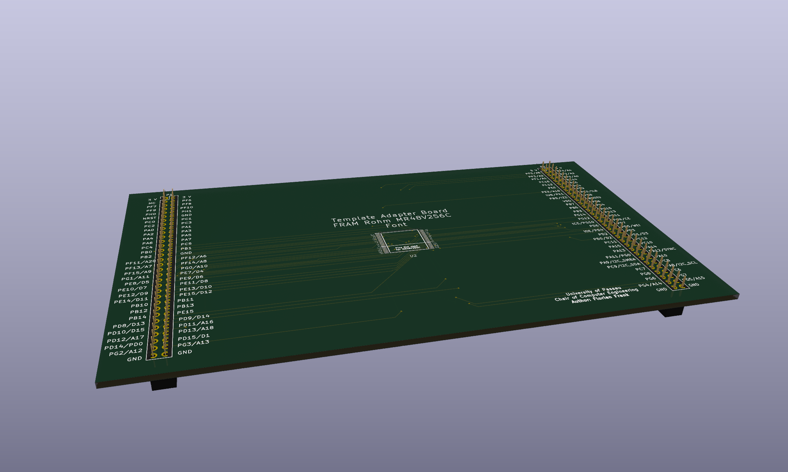
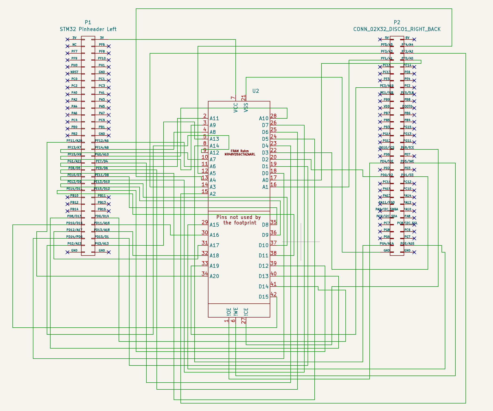
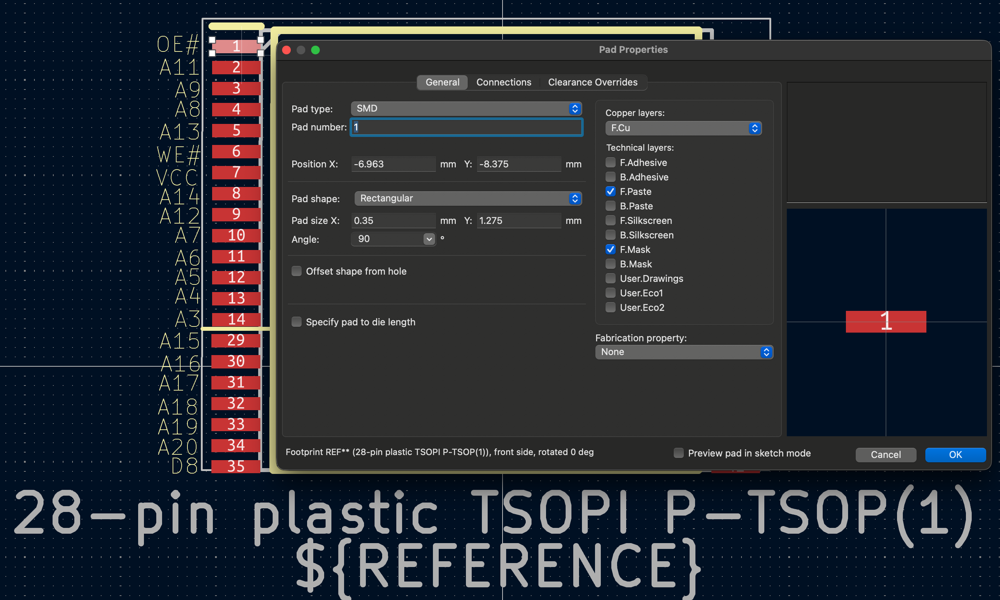
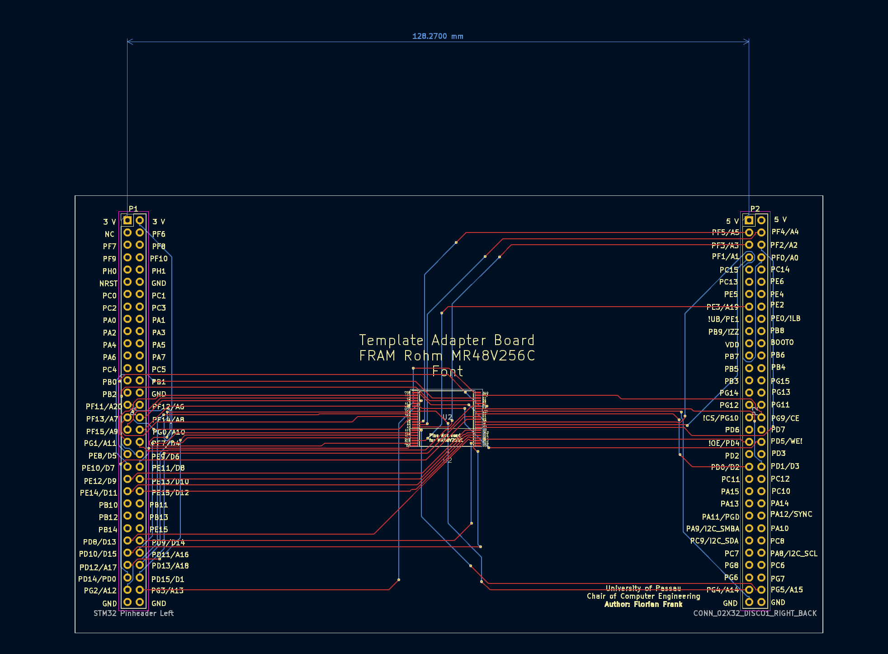

### Memory Template PCB Design

This directory contains a reference adapter board design that can be adapted to different memory types. The current implementation targets the [Lapis Semiconductor MR48V256C](https://www.mouser.de/datasheet/2/348/ROHM-06-04-2018-FEDR48V256C-01-1500402.pdf) FRAM memory module.

A 3D rendering of the board is shown below:

#### Customization for Other Memory Modules
To adapt the design to a different memory device (including alternative packages):

1. Open the KiCad Project (`Adapter_Template_Rohm_FRAM.pro`)

The design was created using **KiCad 8.0.7.**

2. Open the schematic 
    - Identify the two 2×32-pin connectors on the left and right:
        - These connect to the FMC adapter board.
        - **Do not modify these connectors.**
    - Locate the symbol reprenting the memory module in the center: 
        - Either modify the symbol to fit your footprint or
        - adjust the footprint to match the existing symbol

The schematic is shown below for reference:

3. Open the Footprint Editor in KiCad.

To adapt the footprint: 

- Create a new footprint or import an existing one (e.g. from [Component Search Engine](https://componentsearchengine.com))
- Now adjust the pad number so that they match with the ones from the symbol as shown below.

4. Assign the footprint to Symbol U2

5. Export the Netlist `File -> Export -> Netlist``

6. Open the PCB design (`Adapter_Template_Rohm_FRAM.kicad_pcb`)

7. Import the netlist and route the design. 
    > Rooting may be automized for example by using [freerouting](https://www.freerouting.app)

Figure of the reference PCB design: 

8. Now you can export your Design as Gerber file and produce it as cost efficient two layer PCB.