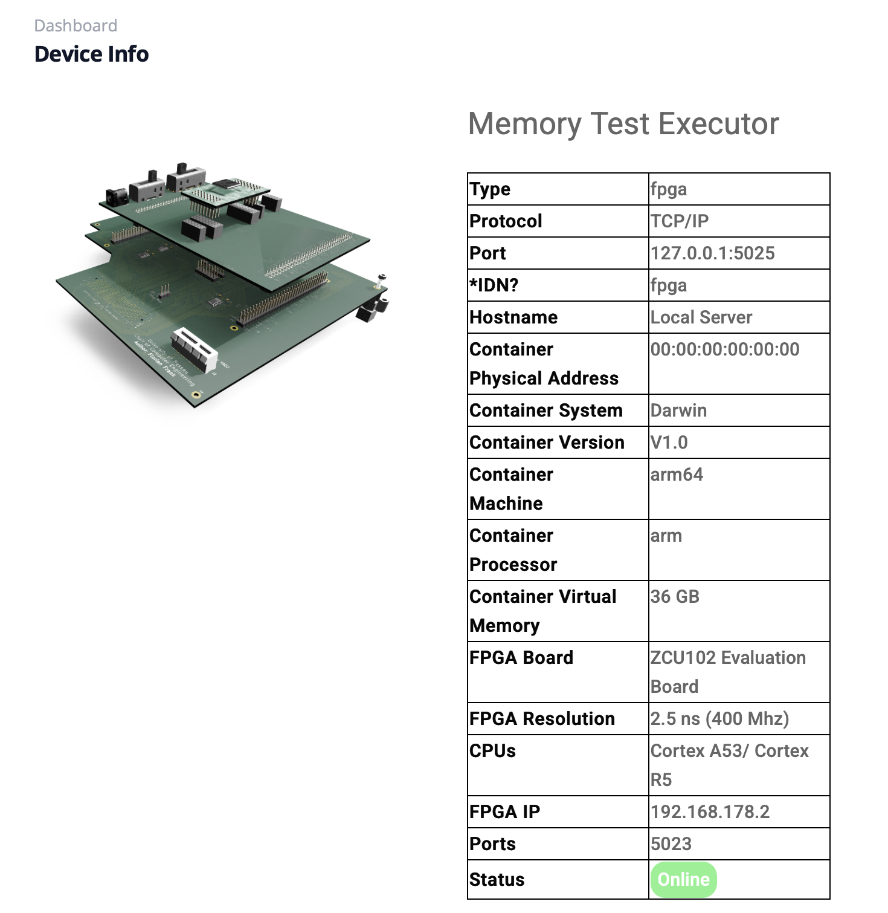
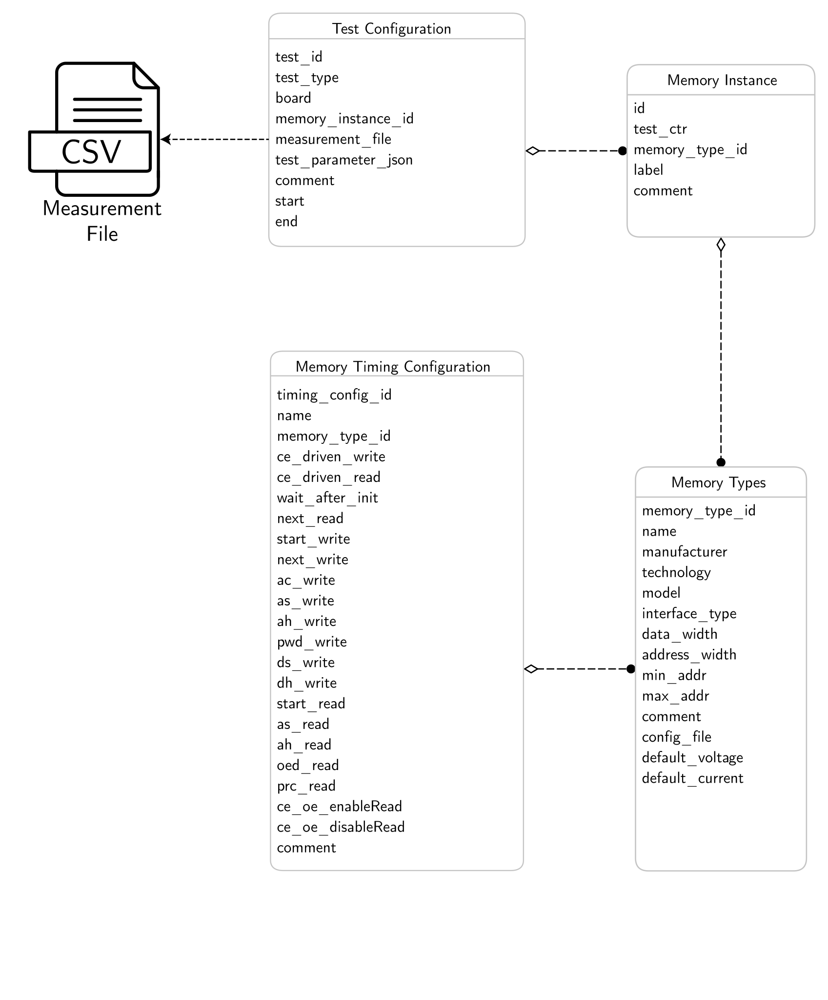

# Experiment Scheduler

In this folder you will find a program capable of scheduling experiments either on the Xilinx ZCU102 or the STM32F429.  
Furthermore, it allows the persistent storage of measurement data as CSV files and the storage of metadata in a SQLite database.

<center>

</center>

Overall, this implementation provides the following functionality:

- Definition of experiments in a YAML-based format with different parameters and parameter ranges.
- Can be started as NATS endpoint running as microservice to interface with a GUI, as explained here [https://github.com/FlorianFrank/experiment_execution_hub](https://github.com/FlorianFrank/experiment_execution_hub)
- Persistent storage and management of different types of memories and their parameters, which can be imported from JSON files.  
- Storage of different test instances and keeping track of the number of experiments.  
- Scheduling of experiments either to an AMD ZCU102 using an Ethernet interface or to an STM32F429 using UART.  
- Persistent storage of measurement data in CSV files, with their metadata stored in a database.  
- Interconnection to measurement devices using our self-implemented instrument control library, specifically the connection 
  with an SPD1305X power supply in order to perform voltage variation tests.

## Configuration when running in Standalone Mode

The program can be customized through multiple configuration files.  
In the `config_files` directory, the configuration of the memory models under test can be found in the `memory_configs` subfolder. For example:


```json
{
 "name": "FRAM_Cypress_FM22L16_55_TG",
  "manufacturer": "Cypress",
  "technology": "FRAM",
  "model": "FM22L16_55_TG",
  "interface_type": "parallel",
  "address_width": 18,
  "data_width": 16,
  "min_addr": 0,
  "max_addr": 200,
  "voltage": 3,
  "current": 0.2,
  "comment": "Also configurable as 8 bit using UB and LB"
}
```

The timing parameters can be found in a dedicated folder `test_config`. An example of such as file is listed below:

```json
{
  "name": "FRAM_Cypress_FM22L16_55_TG",
  "ceDrivenWrite": true,
  "ceDrivenRead": true,

  "tWaitAfterInit": 18,
  "tNextRead":  100000,
  "tStartWrite": 3,
  "tNextWrite": 4,
  "tACWrite": 5,
  "tASWrite": 6,
  "tAHWrite": 7,
  "tPWDWrite": 8,
  "tDSWrite": 9,
  "tDHWrite": 10,
  "tStartRead": 10,
  "tASRead": 9,
  "tAHRead": 8,
  "tOEDRead": 7,
  "tPRCRead": 6,
  "tCEOEEnableRead": 5,
  "tCEOEDisableRead": 4,
  "comment": "Nothing to report"
}
```
These timing parameters have a granularity of 2.5 ns.  
For example, `tStartWrite: 3` corresponds to an actual timing value of `2.5 * 3 + <delay of lvl shifters>`.

For more information about the timing parameters, refer to the `hardware/fpga_design` directory, where you can find timing diagrams for all defined parameters.

> Note that `tNextRead` is set to a relatively large value. This is due to the fact that after each read operation, the measured value is sent to the CPU and then transmitted to this application.

Additional configuration files in this folder define the IP settings for the evaluation and measurement devices.

### Test Specification when running in Standalone Mode

Additional YAML files are provided in the `samples` folder, specifying sets of experiments to be executed on specific memory instances.  
A custom format is implemented to allow you to define your own tests, as shown in the following code example:

```yaml

test_collection:
    platform: "Ultrascale ZCU102"
    memory_type: FRAM_Rohm_MR48V256C
    memory_instance: FeLa2
    iterations: 10

    experiments:
      - experiment:
          type: reliable
          parameters:
            init_value: 0x55
            puf_value: 0xAA
          comment: "CE is aligned with WE at the first flank while CE has an offset of 8.8 ns at the second flank. STM32 was configured with PLL = 120 Hz."

      - experiment:
          type: readLatency
          parameters:
            init_value: 0xAA
            puf_value: 0x55
            tOEDRead:
              range_start: 75
              range_end: 27.5
              step_size: 2.5
          comment: "Configures with CE, OE and WE of equal length on a ZCU102 using level shifters Data lines are connected via J3 Pin. Using Ultrascale+ in steps of 2.5 ns" 
```

This example defines a test configuration for a memory type named **FRAM Rohm MR48V256C**, with the specific memory instance identified as **FeLa2**.  

In the **experiments** section, individual experiments can be defined in sequential order.  
In this example, the first experiment performs a reliable read and write operation on the memory, using an initial value of `0x55` and a PUF value of `0xAA`.  
Afterward, a `readLatencyTest` is executed, where all timing parameters remain unchanged except for `tOERead`.  
Here, explicit timing values or a range can be specified. In this case, dedicated experiments are generated for each timing value between **75 ns and 27.5 ns**, in **2.5 ns steps**, resulting in **19 individual experiments** executed sequentially.  

Thus, ten iterations of the reliability test and the nineteen read latency tests lead to a total of **200 individual experiments** automatically scheduled and performed.  
All parameters not explicitly specified in the configuration use their **default values**.

Further examples on how to define writeLatency or voltage variation tests are provided in the same folder.

## Configuration when running in Microservice Mode

The basic settings for running in microservice mode are defined in ```config_files/micro_service_config.json```.

```json
{
  "general_config": {
    "executor_name": "Memory Test Executor",
    "executor_type": "fpga",
    "protocol": "TCP_IP",
    "scheduler_time_interval": 5,
    "enable_device_discovery": "false",
    "discovery_port": 5025,
    "discovery_interval": 20,
    "heartbeat_interval": 20000,
    "heartbeat_publish_continuously": "false",
    "enable_live_streaming": "true"
  },
  "fpga_config": {
    "ip": "192.168.178.2",
    "port": 5023,
    "board": "ZCU102 Evaluation Board",
    "timing_resolution": "2.5 ns (400 Mhz)",
    "cpus": "Cortex A53/ Cortex R5"
  },
  "nats_config": {
    "nats_broker_ip": "localhost",
    "nats_broker_port": 4222
  }
}
```

This file defines the name of the microservice and the type of measurement device it is connected to. It also specifies 
the scheduler trigger interval (in seconds), as well as the configuration for device discovery and the heartbeat service 
used to communicate with the backend and GUI.
The FPGA configuration flow and the IP address of the target device (e.g., a ZCU102) are defined here as well. In addition, 
the ANTS configuration specifies the IP address and port used to access the service-oriented architecture.

All this information is displayed at the GUI after connecting as shown in the figure below:

<center>

</center>


## Setup

Similar to the other components of this project, we provide scripts to set up the system and run the implementation. 
Before running the program make sure that in `utils/definitions.py` the correct scheduler IPs, suffixes and ports are specified. 

To create a virtual Python environment, install all dependencies, and initialize the database (including storing all memory class and instance definitions found in the `config_files` directory) simply run the following commands:

```bash
./setup_db.sh
```

> ️ ⚠️ Calling this script will delete the content of your sqlite database. Do not call this script again after initialization or backup your database first.


## Execute as Standalone Program

In order to start the scheduler run the following script:

```bash
./run_all.sh -config_file=<Experiment Script>
```
e.g. 

```bash
./run_all.sh -config_file=samples/sample_experiment_write_latency_fram_lapis.yaml
```

You can also run the python application directly by calling

```bash
python3 main.sh -config_file=samples/sample_experiment_write_latency_fram_lapis.yaml
```

This script accepts the following command-line parameters:

- **-config_file=<config_file.yaml>**  
  Specifies the test configuration file to be used.

- **-init_db_scheme**  
  Creates a new database schema, parses all memory configurations found in the `config_files` folder, and inserts them into the database.  
  > ⚠️ **Warning:** This option will drop (delete) the entire database before reinitialization.

- **-refresh_memories**  
  Adds new memory modules by parsing any files placed in the `config_files` folder.  
  Only new modules and parameters not already present in the database will be added automatically.

## Execute as Microservice

The service can be started in microservice mode by simply running: 

```bash
./run_microservice.bash
```

This will automatically launch the program and connect it to the NATS broker (if it is already running).
Instructions for starting the backend and the NATS broker can be found here:
[https://github.com/FlorianFrank/experiment_execution_hub](https://github.com/FlorianFrank/experiment_execution_hub)


## Simulation

To simulate the functionality of the scheduler, a simple simulation program is provided that emulates the MPSoC endpoint. 
It sends acknowledgements and dummy measurement data to mimic a real measurement device.
The simulator can be started with:

```bash
cd ./tests
python3 measurement_endpoint_simulator.py
```

## Evaluation 

All evaluation functions and files can be found in the evaluation folder. 
This directory also includes a Jupyter notebook that demonstrates how to evaluate 
measurement data collected by the scheduler.
> All descriptions can be found directly within the notebook.


## Tools 

Additional tools are available in the `tools` folder.
Currently, this includes a **database merger tool,** which 
allows you to run multiple instances of the scheduler, 
each operating on a separate database. This tool can then 
merge the individual databases into a single combined dataset 
for analysis.

To run the tool, use the following command:

```bash 
python3 db_merger.py db1.db db2.db output.db
```

This command merges the entries from `db1.db` and `db2.db` and 
creates a new merged database named `output.db`.

## Database Scheme

As described above, the measurements are persistently stored in an SQLite database containing all relevant metadata, while the measurement data itself is stored separately in CSV files. This design keeps the database lightweight and portable.

The corresponding schema is illustrated in the following ER diagram:

<center>

</center>

Our scheme contains four tables, allowing the maintenance of specific memory models with corresponding memory timing configurations, extracted from the memory datasheet. Based on these memory types, different memory instances can be added, on which tests are performed. The resulting test data itself is stored as an easy-to-parse CSV file in the following format:


| Memory Address | Read Value | Checksum |
|--------:|------:|---------:|
| 1       | 85    | 86       |
| 2       | 85    | 87       |
| 3       | 84    | 87       |


There is no explicit relation between the Test Configuration and the Memory Timing Configuration, as modified timing parameters, as well as supply voltages or row hammering parameters, are stored in the `test_parameter_json` field. This field contains a JSON object that includes only the parameters deviating from the default configuration, while all unspecified parameters keep their default values.

````json
  {
  "pwd_write": -4, 
  "init_value": 21845, 
  "puf_value": 43690
  }
````

In this example, the `pwd_write` parameter is reduced by 4 × 2.5 ns (the model’s step size). The values 21845 (`0x5555`, checkerboard pattern) and 43690 (`0xAAAA`, inverted checkerboard pattern) define the initialization and PUF patterns, respectively.

Subsequently, sample data for each table is given when performing an experiment on a Rohm FRAM memory module on a ZCU102 board.


### Memory Types

Contains a list of the different memory modules that provide a temlate to a memory instance for executing a test.

| id | name | manufacturer | technology | model | interface_type | data_width | address_width | min_addr | max_addr | comment | config_file | voltage | current |
|---:|:---|:---|:---|:---|:---|---:|---:|---:|---:|:---|:---|---:|---:|
| 1 | MRAM_Everspin_MR4A08BUYS45 | Everspin | MRAM | MR4A08BUYS45 | parallel | 8 | 21 | 0 | 2097151 | none | | 3 | 0.02 |
| 2 | FRAM_Cypress_FM22L16_55_TG | Cypress | FRAM | FM22L16_55_TG | parallel | 16 | 18 | 0 | 262143 | Also configurable as 8 bit using UB and LB | | 3 | 0.02 |
| 3 | MRAM_Everspin_MR4A08BCMA35 | Everspin | MRAM | MR4A08BCMA35 | parallel | 8 | 21 | 0 | 2097151 | none | | 3 | 0.02 |
| 4 | FRAM_Fujitsu_MB85R1001ANC_GE1 | Fujitsu | FRAM | FM22L16-55-TG | parallel | 8 | 17 | 0 | 131071 | Two CE signals while CE2 constantly set to high. Requires 3 power supplied and 3 ground connections | | 3 | 0.015 |
| 5 | FRAM_Rohm_MR48V256C | LAPIS Semiconductor | FRAM | MR48V256C | parallel | 8 | 15 | 0 | 32767 | none | | 3 | 0.02 |

### Timing Configurations

The default timing values, in 2.5 ns increments, assigned to each memory type.

| id | name | memory_type_id | ceDrivenWrite | ceDrivenRead | tWaitAfterInit | tNextRead | tStartWrite | tNextWrite | tACWrite | tASWrite | tAHWrite | tPWDWrite | tDSWrite | tDHWrite | tStartRead | tASRead | tAHRead | tOEDRead | tPRCRead | tCEOEEnableRead | tCEOEDisableRead | comment |
|---:|:---|---:|---:|---:|---:|---:|---:|---:|---:|---:|---:|---:|---:|---:|---:|---:|---:|---:|---:|---:|---:|:---|
| 1 | MRAM_Everspin_MR4A08BUYS45 | 1 | 1 | 1 | 18 | 100000 | 3 | 4 | 5 | 6 | 7 | 17 | 9 | 10 | 10 | 9 | 8 | 7 | 17 | 5 | 4 | Nothing to report |
| 2 | FRAM_Cypress_FM22L16_55_TG | 2 | 1 | 1 | 100 | 0 | 3 | 4 | 5 | 6 | 7 | 30 | 9 | 10 | 10 | 10 | 8 | 7 | 30 | 5 | 4 | Nothing to report |
| 3 | MRAM_Everspin_MR4A08BCMA35 | 3 | 1 | 1 | 18 | 100000 | 3 | 4 | 5 | 6 | 7 | 17 | 9 | 10 | 10 | 9 | 8 | 7 | 17 | 5 | 4 | Nothing to report |
| 4 | FRAM_Fujitsu_MB85R1001ANC_GE1 | 4 | 1 | 1 | 18 | 100000 | 3 | 4 | 5 | 0 | 7 | 48 | 9 | 10 | 10 | 0 | 8 | 7 | 48 | 5 | 4 | Nothing to report |
| 5 | FRAM_Rohm_MR48V256C | 5 | 1 | 1 | 18 | 10000 | 3 | 4 | 5 | 6 | 7 | 30 | 9 | 10 | 10 | 9 | 8 | 7 | 30 | 5 | 4 | Nothing to report |

## Memory Instances

This table lists specific memory instances, each identified by a unique identifier and associated with a memory type.

| id | test_ctr | memory_type_id | label | comment |
|---:|---:|---:|:---|:---|
| 1 | 10260 | 5 | FeLaR1 | old_chip_unknown test_ctr |
| 2 | 10308 | 5 | FRAM R5 | old_chip_unknown test_ctr |
| 3 | 10210 | 5 | FRAM R7 | old_chip_unknown test_ctr |
| 4 | 243 | 5 | FeLa1 | new chip |
| 5 | 350 | 5 | FeLa2 | new chip |


### Test Configurations

A specific test conducted on a memory instance, with parameters adjusted relative to their default values.

| ID | Type | Board | Mem ID | Config | Params | Comment | Start | End |
|---:|:---|:---|---:|:---|:---|:---|:---|:---|
| `1005` | `readLatency` | `ZCU102` | `12` | `readLatency_...csv` | `{"tPRC": -6, ...}` | OE width measured with 50.5 ns CE is aligned with OE at the first flank. | `18:58:24` | `18:58:25` |


