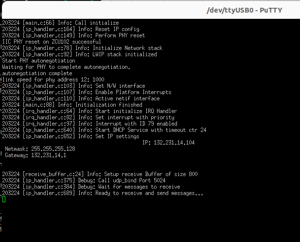

## PS Firmware

In this respository the code corresponding to the PS firmware running on the Cortex A53 on the ZCU102 is implemented. 

### Overview 

The firmware provides the following functionallity: 
- Interaction between the Programmable Logic and the Processing System using the AXI-light protocol. It implements a custom protocol agreed by the PS and PL side.  
- Implemented a TCP/UDP socket for receiving experiment configurations from the experiment scheduler. The communication mode can be selected in a configuration file. The IP address is assigned via DHCP, with a fallback address defined in the configuration file in case DHCP assignment fails.
- Implementaiton of a JSON-protocol parser in C allowing to parse the configuration received from the scheduler.

### Requirements

To compile the firmware for the PS, the necessary toolchains must be installed,
with come with **Vitis 2022.1.** Furthermore, building the firmware requires **Make** and **CMake** to be installed.
Make sure the hardware was exported correctly running the `export_hardware.sh` script within the `fpga_design` folder. More information is provided in the corresponding folder!

### Building the Firmware

Instead of using Vitis directly, we implemented a CMake-based build enrivonment. For this purpose, a toolchain file has been defined in the `memory_controller/toolchain` directory.  In this file, ensure that the TOOLCHAIN_PATH variable is correctly set.
The project was compiled on an **Ubuntu 24.04** system with **Vitis 2022.1** installed. Accordingly, the toolchain path is defined as:
```bash
/opt/Xilinx/Vitis/2022.1/gnu/aarch64/lin/aarch64-none/bin
```

Adjust this path if necessary to your system. 

To compile the firmware, simply execute the the

```bash
build.sh
```

script located in the scripts directory.

This script creates the `memory_controller/build directory`, invokes CMake, and compiles the firmware, resulting in the binary file memory_evaluator.elf. Finally, the ELF file is copied to `memory_controller/out`.

To run the build process manually, navigate to the `memory_controller/` directory and execute:

```bash
mkdir -p build
cd build
cmake ..
make
make install
```

This produces the same result as running the build.sh script. It generates the firmware binary and copies it in the appropriate output directory.

### Flashing the Firmware

In order to flash the firmware we also provided a TCL script capable of automating this task. Again change the directory to `scripts` and execute

```bash
./flash.sh
```

> ⚠️ Make sure the MicroUSB cable for the JTAG (J2) as well as the UART (J38) are connected to your computer and the SW6 switch is set to booting from JTAT as shown in the following figure:
<div style="text-align: center;">
  
</div>

Additionally to see the output of the program you can access the serial port on our system e.g. `/dev/ttyUSB0` with **baud rate 115200.** Now you should see a output like: 

<div style="text-align: center;">
  
</div>

We tested the design using the ZCU’s onboard Ethernet port.
